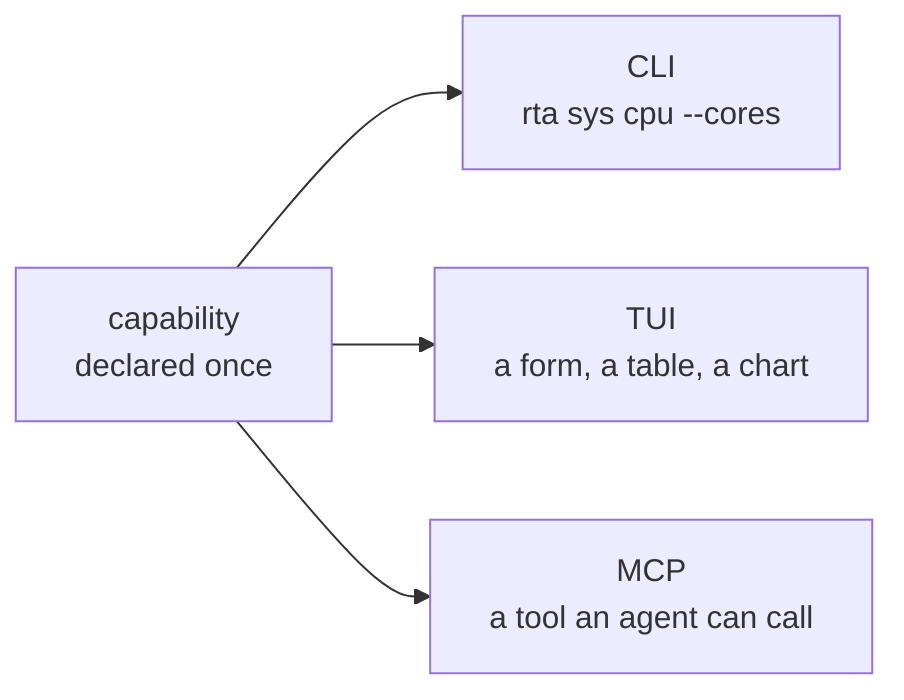

# rta :ring:

**Rule them all** — `rta` on the command line — is one binary over the tools you already juggle: databases, object storage, secrets, networking, certificates, host telemetry, HTTP APIs. Every capability is written once and rendered on three surfaces: a scriptable CLI, an interactive TUI, and an MCP server for AI agents.

## It works with your agent, not instead of it

rta is not another AI CLI, and it does not want to be the thing you talk to. It is the layer underneath the one you already use — Claude Code, Codex, Cursor, Copilot, Gemini — the part that decides what those agents are actually allowed to touch.

That is the whole proposition. Handing an agent a shell is **one decision that covers everything it will ever do**. Pointing it at rta is a different shape: read-only by default, everything else granted per capability, narrowed to one record, expiring on its own, and written down. You keep your agent; it gets a smaller blast radius and you get a record.

Which is why the security chapters are not an appendix, and why every one of them is also usable by a person at a terminal. The same capability serves both — nothing here is an agent-only feature bolted on.

## Where to start

**Installation** and **Quick start** are ten minutes together: the CLI, the TUI, and an agent that can only read.

After that the chapters stand alone, with one exception worth stating because a sidebar cannot: if you are here to give an agent access, read **What rta actually bounds** first. An agent that still has a shell is not bounded by rta at all, and that chapter is what tells you whether you are in the configuration where any of the rest applies. The chapters after it — MCP, grants, the record, team policy — each describe a smaller blast radius than the one before.

## What is in it

**20 built-in plugins, 123 capabilities** in the default build, and `rta plugin list` is the inventory:

`sys` · `net` · `http` · `cert` · `fs` · `kv` · `note` · `gen` · `codec` · `time` · `audit` · `grant` · `agent` · `operator` · `lock` · `pkg` · `debug` · `keys` · `git` · `eol`

Plus anything you install. Ten first-party plugins live in [rta-plugins](https://github.com/this-is-tobi/rta-plugins) as proof the contract works — `pg`, `mysql`, `mariadb`, `etcd`, `qdrant`, `s3`, `vault`, `kube`, `cnpg` and `docker` — each a separate binary from a separate module, so the ones you skip cost you nothing, and `rta plugin index add official` is how they arrive.

## The shape of the thing

Everything in rta is a **capability** — a small, declared unit of work with typed inputs, a safety class, and one implementation. `sys.cpu` is a capability. So is `kv.get`, `pg.query` and `net.dns`.

A capability declares itself once, and the surfaces are generated from that declaration:

Which means three things worth knowing early:

- **`rta explain <capability>`** prints the same card the TUI and the MCP schema are built from. It is the authoritative reference for any command, and it is never out of date.
- **A safety class travels with the capability**, not with the surface. `read`, `write` and `destructive` mean the same thing whoever is asking — the difference is what each surface does about it.
- **Adding a plugin adds capabilities to all three surfaces at once.** There is no separate MCP registration step, and no way for a plugin to appear on one surface and not another.
