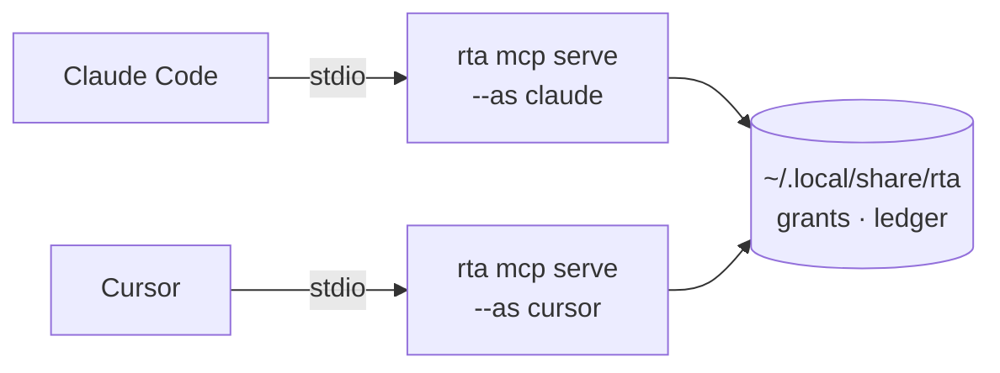

# MCP and the safety gate

rta speaks the Model Context Protocol over stdio by default, and over HTTP with `--http` — see [Remote hosting](#remote-hosting-http). An MCP client — Claude Code, VS Code, Cursor, Codex, Gemini, Copilot — launches `rta mcp serve` and gets every capability as a tool, with typed schemas, safety annotations and structured results.

The interesting part is not that it works. It is what an agent can reach before you have decided anything.

Everything in this chapter assumes the agent goes through the server. An agent that can also run shell commands can run `rta` itself, and [what that does to the guarantees](./10-the-boundary.md) is worth reading first.

## Registering a client

```bash
rta mcp install claude
```

Supported clients: `claude`, `vscode`, `codex`, `gemini`, `cursor`, `copilot`. Anything else that speaks MCP works too — see [Connecting your AI tool](./60-ai-clients.md) for the per-client detail, including where each keeps its configuration and how to check afterwards that it worked.

Where a client ships its own command for editing its own configuration, rta runs that. Where it does not, rta prints what to add and where, and stops:

```bash
rta mcp install cursor
```

```
Add this to ~/.cursor/mcp.json (or .cursor/mcp.json for one project):

{
  "mcpServers": {
    "rta": {
      "command": "/usr/local/bin/rta",
      "args": ["mcp", "serve", "--as", "cursor"]
    }
  }
}
```

### rta does not write another tool's config file

This is deliberate, and there are three reasons in descending order of importance:

- **That file is what grants an agent access to your secrets.** A tool whose entire argument is that consent should be visible and deliberate has no business writing itself into five agents' permission files unattended.
- **Those files hold things rta must not touch.** VS Code's `mcp.json` is JSONC — comments and all — and often carries API keys in headers. A parse-and-rewrite would destroy comments at best and mishandle a credential at worst.
- **A config format changes when its client changes, not when rta does.** The tool that owns the format is the one that stays correct.

`--show` prints the block without running anything, for any client.

## Naming the agent

```bash
rta mcp install claude --as work-laptop
```

Without a name, every MCP client on your machine is **one principal**: consent given while talking to one follows all the others. `--as` is what keeps an agent's grants its own, and `rta mcp install` always passes it — the default is the client's name.

The name is your word, not the agent's. A client announces itself in the protocol handshake, and rta records that claim, but it does not authorize on it — *a name a thing chooses for itself is not an identity*. What authorizes is the name you typed when you wired the client up.

You will see both in the record: the agent name plainly, the client's self-report in parentheses.

## What is exposed, before you decide anything

**Only read capabilities.** That is the default, and it holds with no flags, no config and no decisions.

| Safety class | Exposed over MCP by default | How to open it |
| --- | --- | --- |
| `read` | ✅ yes | — |
| `write` | ❌ no | `--allow-write <plugin>` |
| `destructive` | ❌ no | `--allow-destructive <capability-id>` |

```bash
rta mcp serve --allow-write note
rta mcp serve --allow-destructive note.rm
```

Writes open **one namespace at a time** rather than registry-wide. Destructive capabilities are named individually — there is no wildcard, on purpose.

A destructive capability from an external plugin must be pinned to that binary's digest:

```bash
rta mcp serve --allow-destructive hello.wipe@5dae737f8845
```

So the authorisation attaches to an artifact rather than to a name a replacement would inherit.

### The path gate

Every path argument must sit under a **root**. The default root is the directory the server was started in; widen it with `--root`, which is repeatable.

```bash
rta mcp serve --root ~/projects --root /tmp/scratch
```

The gate governs path *arguments* only. A capability that opens a fixed file of its own — `net hosts list` and `/etc/hosts` — is unaffected, because that path is never an argument for anyone to send.

rta says its roots out loud at startup rather than leaving them to be discovered from a refusal:

```
rta mcp server listening on stdio
path arguments confined to: /Users/you/projects, /tmp/scratch
```

### Two gates, different jobs

The `--allow-*` switches are decided **once**, when the server starts, for every call it will ever make. That is the coarse gate, and it is the right shape for "this agent works on notes".

[Grants](./30-grants.md) are the other half: consent for one capability, optionally one record, expiring on its own. That is the fine gate, and it is what you reach for when the answer is "this once".

## Live consent

Off by default:

```bash
rta mcp serve --consent --consent-notify
```

With `--consent`, a call that needs a grant nobody issued is **parked** instead of refused. You answer it:

```bash
rta agent pending
rta agent show 5473aa62        # everything about it, including what it would do
rta agent allow 5473aa62
rta agent deny 5473aa62
```

`--consent-preview` (on by default) runs the capability's own `--dry-run` and shows the result on the parked request, which changes the question from *"may this agent call `note.rm`"* to *"may it remove **this note**"*.

`--consent-wait` bounds how long a call waits before it is refused anyway (default 90s).

**The default is off on purpose.** A call parked in a server nobody is watching is worse than a refusal: the agent hangs, you never see it, and the timeout is the only thing that resolves it. Turn consent on when you are actually at the machine — or, for a remote server, when [the operator channel](#the-operator-channel) gives its enrolled operators a way to answer with `--server`.

## Environment inheritance

An MCP server inherits the environment it was started from. If your secret store unlocks without a passphrase in that environment, the server can open it — bounded by grants, but able to.

```bash
rta doctor
```

```
kv store    info    unlocks from this environment — an MCP server started here
                    can read secrets, bounded only by grants
```

That line is the whole warning. It is not a misconfiguration; it is a fact about how you set the store up, and it is worth knowing before you connect a client.

## The working directory is the client's choice

A server also inherits its working directory, and two things are decided by it: the default path root, and where the walk up for a [team policy](./50-team-policy.md) starts. You did not choose that directory — the client did.

So a committed `.rta-policy.yaml` bounds this agent only if the client happened to start inside that repository. rta says which one it found at startup, beside the roots:

```
rta mcp server listening on stdio
path arguments confined to: /Users/you/projects
rta: team policy: /Users/you/projects/.rta-policy.yaml
```

`none in force` there means the ceiling you committed is not the one applying. `rta policy require` turns that into a server that refuses to start rather than a line somebody has to notice.

## Where the server runs

Over stdio, the default, there is no daemon, no port and nothing to start. `rta mcp serve` is a child process of your MCP client, speaking JSON-RPC over its own stdin and stdout, and it lives exactly as long as the client does. Two clients means two processes:



Two processes, one grant file — which is the whole reason [`--as`](#naming-the-agent) exists. Without a name they are one principal, and consent given while talking to the first covers the second.

### For one session, or for one task

The server is per-session by construction, so the question is really about the permissions, and those have their own clocks rather than the process's:

| Bound to a task by | What it does | Where |
| --- | --- | --- |
| `rta grant allow … --ttl 30m` | Consent that expires on its own, whatever the server does | [Grants](./30-grants.md) |
| `rta grant allow … --max-uses 5` | Consent that runs out by use rather than by clock | [Grants](./30-grants.md) |
| `rta use staging` | While it is on, every *other* environment is refused whatever grants exist | [Profiles](../20-using/40-profiles.md) |
| `rta grant revoke --all` | The end of the task, without touching the client | [Grants](./30-grants.md) |

Restarting the server changes none of it. That is deliberate: a deadline that ended when a process did would be a deadline your editor could reset by crashing.

### In a container, for a hardened server

The binary is static and needs almost nothing at runtime — almost, because `cert`, `http`, `audit web` and every plugin that dials TLS (`pg`, `s3`, `vault`, `qdrant`...) still need a CA bundle to verify against, which a bare `scratch` image does not have. [`ghcr.io/this-is-tobi/rta`](https://github.com/this-is-tobi/rta/pkgs/container/rta) is built `FROM gcr.io/distroless/static-debian12:nonroot` instead: that CA bundle and the `/etc/passwd` entry for its nonroot user, and nothing else — still no shell, no package manager, no libc for anything to reach. Published multi-arch (`amd64`/`arm64`) with every release, with SLSA provenance, an SBOM and a cosign signature attached to the image digest. Point the client at `docker` instead of at `rta`:

```json
{
  "mcpServers": {
    "rta": {
      "command": "docker",
      "args": [
        "run", "--rm", "-i",
        "--read-only", "--cap-drop", "ALL", "--security-opt", "no-new-privileges",
        "--network", "none",
        "-v", "rta-home:/rta-home",
        "-v", "${workspaceFolder}:/work:ro",
        "-e", "RTA_CONFIG=/rta-home/config.yaml",
        "-e", "RTA_DATA_DIR=/rta-home",
        "-w", "/work",
        "ghcr.io/this-is-tobi/rta:latest", "mcp", "serve", "--as", "sandboxed", "--root", "/work"
      ]
    }
  }
}
```

What each part is doing, since a hardening flag nobody can explain is a hardening flag somebody deletes:

| Flag | Why |
| --- | --- |
| `-i` | stdio is the transport; without it the client and the server never meet |
| `--read-only`, `--cap-drop ALL`, `--security-opt no-new-privileges` | The server needs none of it, so it gets none of it |
| `--network none` | The strongest setting, and it turns off every capability that reaches the network — `audit web`, `net dns`, `pg` against anything remote. Drop it when you want those |
| `-v rta-home:/rta-home` | Grants and the ledger have to outlive the container, or every restart is a machine with no memory of what you allowed |
| `-e RTA_CONFIG`, `-e RTA_DATA_DIR` | **Not optional.** With no config directory the config path falls back to `./.rta.yaml`, and a working-directory file is not honoured — `profiles:`, `plugins:` and `dashboard:` are all ignored, so a plugin would run with its declared defaults |
| `-w /work` + `--root /work` | The path root defaults to the working directory, which in a container is `/` unless you say otherwise |

**The image is the plugin allowlist.** A plugin is a separate binary, so a plugin that is not in the image is a plugin the agent cannot reach — no trust decision, no digest, no `$PATH` to search. Building the image with two plugins in it is the narrowest reach rta can be given.

Which is exactly why **`ghcr.io/this-is-tobi/rta-full` is the wrong image to point an agent at.** It carries every first-party plugin and every external tool, so it is the widest reach rta has, and pointing an MCP client at it throws away the one boundary this section is about. It exists for a person at a terminal who wants a console; for an agent, build the narrow image with the plugins that job needs — the recipe is below.

The trade is real and worth stating: a containerized server sees the container's filesystem and network, so `fs tree` maps what you mounted and nothing else, and `git status` sees `/work`. That is the point, and it is also the reason this is not the default.

### A team: share the configuration, not the process

The want is real and worth stating plainly: a team has environments — dev and staging for app A, staging and production for app B — everyone has their own agent, and nobody wants to configure the same six profiles on eight laptops. What people reach for is one shared MCP server everyone points at.

**Share the image instead.** A profile is written by a command, so it can be baked in at build time, and every member starts with the environments already there and nothing to configure:

```dockerfile
FROM alpine:3.20 AS setup
COPY --from=ghcr.io/this-is-tobi/rta:latest /usr/local/bin/rta /usr/local/bin/rta
COPY rta-plugin-pg /usr/local/bin/
ENV RTA_CONFIG=/rta-home/config.yaml RTA_DATA_DIR=/rta-home
RUN mkdir -p /rta-home && \
    rta plugin trust pg --yes && \
    rta profile set app-a-staging --note "app A, staging" --ttl 8h \
      --plugin pg --set database=app-a \
      --kube staging/app-a/svc/postgres:5432 \
      --secret password=kube:postgres-creds/password && \
    rta profile set app-b-prod --note "app B, production" --ttl 1h \
      --plugin pg --set database=app-b \
      --kube prod/app-b/svc/postgres:5432 \
      --secret password=kube:postgres-creds/password

FROM gcr.io/distroless/static-debian12:nonroot
COPY --from=setup /usr/local/bin/ /usr/local/bin/
COPY --from=setup /rta-home /rta-home
ENV RTA_CONFIG=/rta-home/config.yaml RTA_DATA_DIR=/rta-home PATH=/usr/local/bin
ENTRYPOINT ["/usr/local/bin/rta"]
```

The `setup` stage needs Alpine's shell to run `rta plugin trust`/`rta profile set` at build time — it never ships. The final stage starts over from the same distroless base the published image uses, for the same reason: `pg` over TLS needs a CA bundle to verify against, same as the primary recipe above.

Each member wires their client to `docker run` on that image, exactly as in the recipe above, mounting their own `~/.kube` and their own state volume. What the image carries is a *reference*, never a value:

```yaml
secrets:
  password: kube:postgres-creds/password
```

So the image is safe to publish to your internal registry. The credential is read at call time from the cluster, **with the caller's own kubeconfig and their own RBAC** — the access control your organisation already runs keeps applying, per person, unchanged. The same is true of the `kube:` forward: reaching the database at all requires that member's cluster access.

That is the whole of "without any config", and everything else stays where it belongs. Grants are theirs. The ledger says what *they* did. `rta use` bounds *their* agents. Nothing is shared that a person has to be accountable for.

Add [`.rta-policy.yaml`](./50-team-policy.md) to the repositories they work in and the team also gets a ceiling — committed, travelling with a clone, needing no seal because it can only ever subtract.

### Why not one server for everyone

Because "a shared server that can reach everything anybody is authorised for" is a single process holding the union of every environment's credentials, reachable by every member's agent. Concretely, it costs you five things:

| What breaks | Why |
| --- | --- |
| Per-person access control | The server authenticates as itself. Your cluster RBAC, database roles and cloud IAM stop distinguishing between eight people and start seeing one service account |
| The record | rta logs the agent name a person typed on their own machine. On a shared process every client is a client of the same process — two members' agents both log as `claude`, and nobody can answer who ran `pg dump` |
| Live consent | `--consent` parks a call and waits for the person at the machine. On a shared server, which person? Whose desktop notification rings, and who is accountable for the answer? |
| `rta use` | It exists to *subtract* — switching to staging takes production away from every agent. Shared, one person switching takes it away from everyone, silently |
| Blast radius | One compromised agent on one laptop reaches the union of every environment, because the union is what the server was configured with |

The transport was the smaller problem, and smaller than it first looked: [Remote hosting](#remote-hosting-http), below, is `--http` — authenticated over the wire instead of by parent-process trust, so "who is on the other end" has a standard answer. What it does not change is anything in the table above — authenticating five people to one process that holds the union of their environments tells you which of them is calling and leaves every other row exactly as it is.

None of that is an argument against rta running somewhere other than a laptop. Run it in your dev platform, in a Codespace, in a per-user pod — **one instance per person, authenticating as that person**, built from the shared image. That is the same convenience with none of the collapse.

## Remote hosting (HTTP)

```bash
rta mcp serve --http 127.0.0.1:8443 --token-file tokens.txt --as work
```

A second transport, opt-in: the server listens on TCP instead of speaking stdio to a parent process, which is what running it somewhere other than your own machine — the shape the previous section argues for — actually needs.

A caller now has to prove who it is over the wire, since there is no parent process left to trust instead. Two mechanisms, usable together:

| Flag | Proves |
| --- | --- |
| `--token-file <path>` | A static, operator-issued token — one `label token` pair per line in a file only the operator can read; world-readable files are refused |
| `--oidc-issuer`, `--oidc-audience`, `--oidc-subject` | A real identity provider's token, for one of the named subjects. An issuer and audience alone identify an application, not a person, so at least one `--oidc-subject` is required |

`--http` refuses to start with neither configured. `--consent` over `--http` additionally requires `--operators` — a parked call waits for a person, enrolled operators answering over [the operator channel](#the-operator-channel) are the only people positioned to be that person, and a control nobody can exercise must not be allowed to pretend it works.

TLS is not this process's job. Bind to a private address and put a reverse proxy, ingress or service mesh in front of it for termination.

Every request's verified identity is recorded a third way, beside `--as` and the client's own self-report: `rta agent log` shows which credential actually authenticated each call — a token's label, an OIDC subject — so more than one credential valid for an instance stays distinguishable instead of collapsing into one indistinguishable principal.

### The operator channel

A remote server closes the agent out of `grant allow` — and closes you out with it: its grant roster lived behind whatever infrastructure access reaches the machine. The operator channel is the way back in that an agent cannot use.

```bash
# on your machine, once
rta operator init                     # mints your key; prints the line below
# on the server, in a file only its owner can write
tobi 4Jx…base64…Qk=                   # one "label base64-pubkey" per line
# start the server with it
rta mcp serve --http :8443 --token-file tokens.txt \
  --operators operators.txt --operators-url https://rta.example.com
```

`--operators-url` is the server's canonical identity — the exact URL operators write in their `remotes.yaml` — and it is signed into every operator request. That is the anti-relay binding: a hostile server you also talk to could present another server's challenge as its own, but the envelope it collects names the server you were actually addressing and verifies nowhere else.

`--operators` mounts `/operator/v1` beside the MCP endpoint. Name the server in `remotes.yaml` beside your config —

```yaml
servers:
  work:
    url: https://rta.example.com
```

— and the existing verbs grow a `--server` flag. `rta grant list --server work` reads that server's roster; `rta operator status --server work` asks who it is (version, agent name, guard state, enrolled operators); `rta grant revoke kv --server work` takes authority back, with `--dry-run` previewed by the server's own store rather than guessed at from here; `rta agent pending --server work` reads its parked queue, and `rta agent allow`/`deny` answer it. Each call names its target, because an ambient "current server" is how a staging command lands on prod.

Issuing remotely takes one more provisioning step, because a grant is authority and authority needs a signature the server will honour. On the server, once: `rta grant guard remote operators.txt --url https://rta.example.com` enrolls the roster's keys as the machine's [guard](./30-grants.md), bound to its canonical URL — after which a grant is honoured only when an enrolled operator signed it *for this server*, and `rta grant allow` at the server's own shell has no key to unlock, by construction. The binding is what keeps a fleet sharing one roster from becoming one trust domain: a grant signed for staging verifies on no other machine, however its bytes travel. Then, from your machine:

```bash
rta grant allow kv.get db-password --ttl 15m --server work
```

The server *prepares* the grant — validation, TTL clamping against its policy, profile pinning, attribution — under its own config and catalogue; your rta then checks the draft against what you asked before anything is signed, field by field, with the server licensed only to clamp the lifetime downward — a compromised server must not be a signing oracle for authority nobody requested. Your passphrase unlocks the operator key; what survived the check is signed byte-for-byte and submitted; and the stored row carries `operator:<label>` in its Origin column, so a multi-operator server's listing names who issued what. The server re-checks everything on submission — attribution against the caller the envelope proved, untouched consumption bookkeeping, clock skew, expiry, both TTL ceilings — and the guard's own load-time enforcement then verifies the signature and its server binding on every read, like any other guard-signed row.

[Live consent](#live-consent) travels the same way, and it is what makes `--consent` legal beside `--http` at all: start the server with both plus `--operators`, and a call that parks waits for an enrolled operator rather than for nobody. `rta agent pending --server work` lists the queue, `rta agent show <id> --server work` reads one call in full, and `rta agent allow`/`deny` answer it — every answer signed under your passphrase, the one-shot included. That last part is a deliberate asymmetry with the local flow, where a bare `agent allow` is passphrase-free because it releases a call an agent with a shell could have run directly: that shell-equivalence argument does not travel a network, so remotely there is no passphrase-free answer. The binding is the digest the local flow already rests on, made to cross the wire: your machine derives it from the fields it *displayed* — never copies it from what the server sent — and the server compares it against the parked file at the moment the sealed decision is minted, so a queue entry that changed after you read it, or a server that showed you one call while parking another, produces a refusal instead of an approval. (`--ttl` stays out of a remote answer: a standing grant is the prepare-and-sign flow above, with its own review step.)

What makes this channel one an agent cannot ride: every call is an ed25519 signature over the server's canonical URL, a single-use nonce the server just issued, the verb and its payload — and the signing key exists on your machine only inside a passphrase, the [guard](./30-grants.md)'s own mechanics pointed outward. The passphrase arrives through a prompt or the TUI's masked field, never from the environment, and is refused on the command line; so an agent that reads every file you own still cannot sign, a captured request replays nowhere and verifies on no other server, and an agent's bearer token opens nothing here — the two mechanisms never meet. The server, for its part, holds only public keys: compromising it forges no operator's hand.

Everything the channel *changes* is written into [the record](./40-audit-trail.md) beside the agent's own calls: a revocation, an issued grant, an answered consent, a lock placed or lifted — one line each, `operator.` in front of the verb, attributed `operator:<label>` in the credential column, refusals included. The record that shows a parked call `approved` therefore also shows who approved it, from which enrolled key. Reads stay off the record: a watching dashboard polls `status` every few seconds, and recording polls would churn real history out of the ledger's retention.

The roster is the token file's kind of trust anchor and gets the same treatment: rta never writes it, weak permissions refuse startup, and it is read once — a rewrite behind a running server's back changes nothing until the next deliberate restart. Plain `http://` in `remotes.yaml` is refused for anything but loopback, and for the OIDC issuer's reason: the signature protects what you send, TLS protects what you *read* — a grant listing rewritten in transit is decisions made on a lie.

A roster line is `label base64-pubkey` — the exact line `rta operator status` prints on the operator's own machine — optionally annotated `role=read` and/or `expires=YYYY-MM-DD`. A read-only key answers `status`, `grant.list`, `consent.list` and `lock.list` and nothing else: no revocation, no issuance, no consent answers, and `grant guard remote` never enrolls it as grant-signing trust, so even its stolen key mints nothing. The intended occupant is a component rather than a person — a status page or dashboard watching the queue and the grants under its own key, with a blast radius of reads. A bare line stays what it has always been, a full operator; and anything unrecognized in the annotation position refuses the whole file, because a typo that silently meant "full" is the one failure a restriction must not have.

`expires=` turns a departure everyone knows is coming — a contractor's end date, a component being retired — from a memory problem into a clock problem: the key stops working when that day arrives, checked per call against the running server's clock, so this is the one roster edit that needs no restart to take effect. It only subtracts. The row still shows on the status page after its day, marked `expired`, because that row is a chore: deleting the line is still the real eviction, and an already-expired key stays out of what `grant guard remote` would enroll. A date rta cannot read refuses the whole file, same as any other annotation typo. For a departure nobody saw coming, that is not this — that is a [lock](#locks-the-instant-no).

### Locks: the instant no

Expiry and revocation both leave a gap that only shows during an incident: revoking every grant still leaves a misbehaving agent's bearer token opening the ungated read tools, and a compromised operator key stays enrolled until someone edits the roster and restarts — the roster is deliberately read once. A **lock** is the instant path:

```bash
rta lock add agent claude --note "runaway loop, ping me"   # on the machine
rta lock add operator dash --server work                    # or from your machine, signed
rta lock list
rta lock rm agent claude
```

A locked *agent* or *credential* is refused on every tool call before any other gate (the protocol's own handshake and catalogue listing still answer — nothing executes through them) — never parked as a consent question, because a lock is the "stop asking me" control — and a locked *operator* label gets no verb on the channel at all. Running servers pick a lock up on their next request, no restart, and the note travels to the locked party on every refusal. Locks only subtract, so placing one asks for no passphrase: revoking never asks, and an incident is the wrong moment to demand a secret. `--ttl 2h` makes one lift itself; without it a lock stands until `rta lock rm`.

Two edges worth knowing before you need them. First lock wins: a locked operator cannot unlock anyone, themselves included, so a fully locked-out roster is recovered at the machine's own terminal — where `rta lock` always works, because the person standing there is the authority locks answer to. And the lock file is sealed like the grant file, with the guard's failure direction: a running server that saw locks keeps enforcing them even if the file is deleted out from under it, so the `rm` that would quietly restore access restores nothing for the process the attacker is talking through. Lifting a lock is `rta lock rm`, on the machine or as a signed operator call — never a file deletion.

Locking an operator freezes the key, not what it already signed — pair it with `rta grant revoke` for anything that key issued. It silences the key's verbs, not its ink: a locked key's mutation attempts keep landing in [the record](./40-audit-trail.md) as refusals, which is the evidence trail working — and also why a key you believe compromised is one to remove from the roster (edit the `--operators` file, restart), not merely to lock forever: enrollment is what lets it make the server write anything at all. And `rta lock` is on the harness deny list `rta audit agents --fix` prints, for the expanding half: an agent that could run `lock rm` would be unfreezing itself.

`sys`, `fs`, `git`, `keys.list`, `kv.status`, the two `audit` checks that grade a project on this disk (`audit.deps`, `audit.why`), and the parts of `net` that read or change this host's own network configuration (`net.info`, `net.hosts.*`, `net.resolver.*`) answer for the machine rta happens to run on. Over HTTP those are never registered as tools at all — absent from `tools/list`, not refused when called — because a remote caller is never this machine. `rta mcp serve --http` says so at startup:

```
rta mcp server listening on http://127.0.0.1:8443
rta: every request needs a bearer token; TLS is not this process's job — put a reverse proxy, ingress or service mesh in front of it
rta: remote transport hides 28 capabilities that describe this machine: audit.deps, audit.why, fs.hash, fs.tree, … (28 total)
```

Everything else in `net` — `ping`, `dns`, `trace`, `probe`, `send`, `port` — stays reachable, since those describe a caller-named target rather than this host. A result still reflects the vantage point of wherever rta is actually running, which is worth knowing rather than assuming.

### What is still true, and what stops being true

The credentials-move trade [the container recipe above](#in-a-container-for-a-hardened-server) rests on — "the caller's own kubeconfig, the caller's own RBAC" — needs restating here rather than assumed. A container on your own machine still has *your* kubeconfig mounted into it; a real network call has no caller-side credential at all, only whatever the server's own ambient identity is. Provision that identity as deliberately as any other production credential.

The `kv` store is exactly as strong remotely as locally, no stronger — "unlocks from this environment" (`rta doctor`) is equally true of a laptop and a gateway, with no hardware-backed second factor either way. Prefer a passphrase over a plaintext identity file sitting on a host other people can reach.

Plugin confinement (`rta doctor`'s "plugin confinement" row) is `sandbox-exec` on macOS and nothing on Linux — a deliberate, documented gap rather than an oversight, and Linux is the realistic OS for a remote gateway. A hardened deployment supplies its own process sandboxing there — containers, seccomp, a read-only root filesystem, an egress allowlist — since rta contributes none of its own on that platform.

Consent now has exactly one place to go. `--consent` combines with `--http` only when `--operators` names a roster, because answering a parked call needs a channel to reach a person, and [the operator channel](#the-operator-channel) is the one built for it — a signed answer from an enrolled operator's own machine, never a bearer credential an agent could ride. What has *not* changed is the multi-user arithmetic: one queue, several operators, first answer wins, and the accountability question the [cost table](./10-the-boundary.md#what-this-means-for-a-team) raises for a shared server is answered only as far as the decision file naming which operator signed — the rest of what a shared server would take still stands.

`--network none` in [the container recipe above](#in-a-container-for-a-hardened-server) was only ever safe because stdio needs no network at all. A listener needs an inbound path: publish the container's port to wherever the reverse proxy in front of it reaches, and keep outbound scoped to what the enabled plugins actually call — not open, and not none.

## Next

- [What rta actually bounds](./10-the-boundary.md) — the precondition everything above rests on
- [Connecting your AI tool](./60-ai-clients.md) — the per-client setup detail
- [Grants](./30-grants.md) — per-capability, time-boxed consent
- [The record](./40-audit-trail.md) — what actually happened
- [Team policy](./50-team-policy.md) — a ceiling nobody can raise
